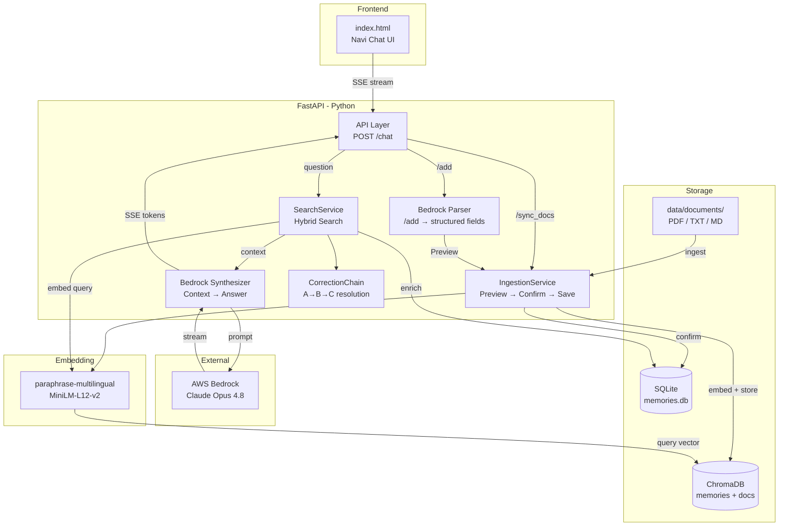
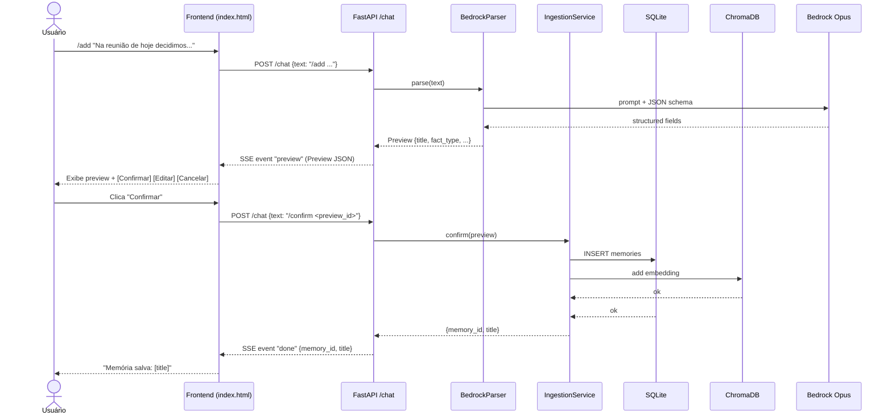
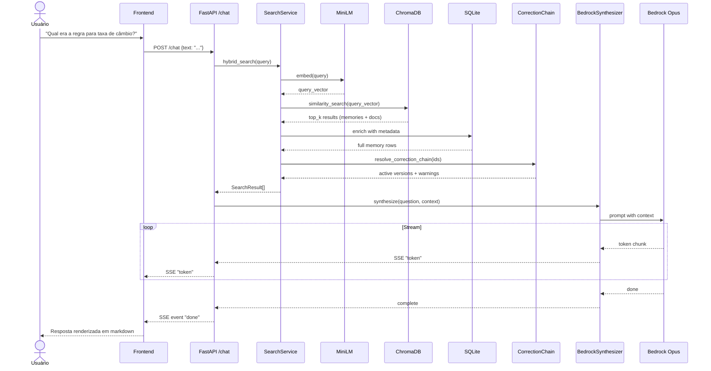
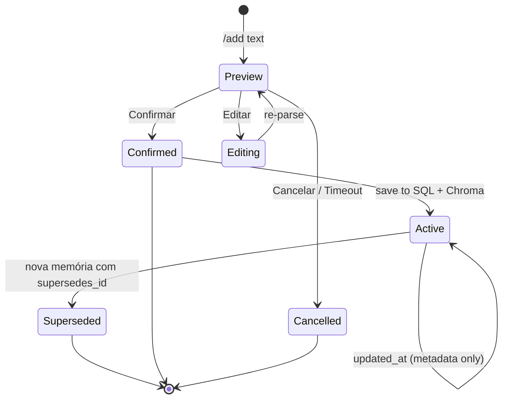
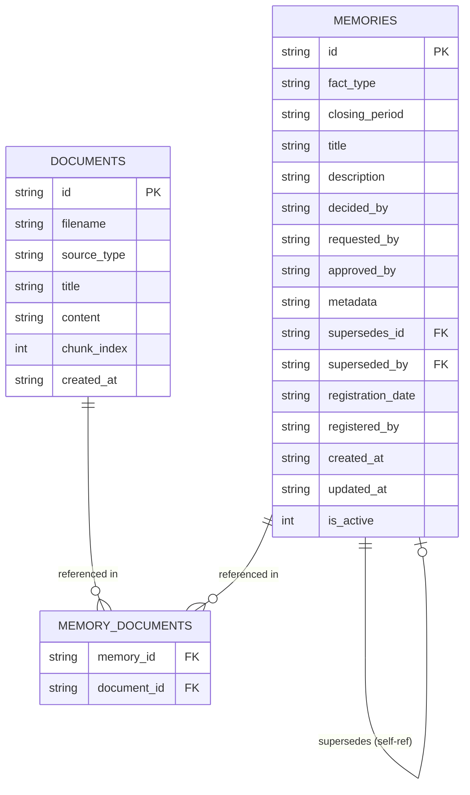

# Arquitetura — Cérebro Institucional (RAG + Memórias)

> Sistema local de memória institucional para o processo de fechamento mensal do maior banco da América Latina.
> Stack: Python + FastAPI + SQLite + ChromaDB + MiniLM (embedding local) + AWS Bedrock Claude Opus (LLM).

---

## 1. Visão Geral

- **Navi** é a interface de chat (frontend `index.html`, backend FastAPI).
- Duas ações do usuário:
  - `/add <texto>` — adicionar memória (parser → preview → confirm → save)
  - Pergunta em linguagem natural — hybrid search → síntese via Bedrock → SSE streaming
- **Apenas 1 endpoint:** `POST /chat` (SSE streaming).
- Dados **nunca saem da máquina** (exceto o prompt final para Bedrock, com contexto filtrado).

---

## 2. Stack Técnica

| Camada      | Tecnologia |
|-------------|------------|
| Backend     | Python 3.11+ / FastAPI / Uvicorn (sync) |
| Frontend    | HTML + Tailwind CDN + Canvas (fairy theme) + marked.js + DOMPurify |
| Database    | SQLite (`sqlite3` stdlib, síncrono) |
| Vector DB   | ChromaDB `PersistentClient` (embedded) |
| Embedding   | `paraphrase-multilingual-MiniLM-L12-v2` (sentence-transformers, local) |
| LLM         | AWS Bedrock `anthropic.claude-3-opus-20240229-v1:0` |
| Deploy      | pywebview → PyInstaller `.exe` (Windows) |
| Desktop     | pywebview (thread Uvicorn + webview window) |

---

## 3. Estrutura de Diretórios

```
gf_navi/
├── app/
│   ├── __init__.py
│   ├── main.py                  # FastAPI entry point + startup
│   ├── config.py                # Pydantic Settings + Bedrock client init
│   ├── models.py                # Pydantic schemas (Memory, Document, ChatMessage, Preview)
│   ├── api/
│   │   ├── __init__.py
│   │   └── chat.py              # POST /chat endpoint (SSE)
│   ├── storage/
│   │   ├── __init__.py
│   │   ├── sqlite_store.py      # SQLite CRUD + migrations
│   │   └── vector_store.py      # ChromaDB wrapper (2 collections)
│   └── services/
│       ├── __init__.py
│       ├── bedrock_parser.py    # LLM parser para /add → structured fields
│       ├── bedrock_synthesizer.py # LLM síntese + SSE streaming
│       ├── ingestion.py         # Save memory + link docs + preview + confirmation
│       ├── search.py            # Hybrid search + doc expansion + correction chain
│       └── correction_chain.py  # Supersedes chain logic
├── scripts/
│   └── ingest_docs.py           # Manual document ingestion
├── data/
│   ├── documents/               # PDF / TXT / MD files
│   ├── memories.db              # SQLite database
│   └── chroma/                  # ChromaDB persist directory
├── pywebview_entry.py           # pywebview init (thread uvicorn + webview)
├── index.html                   # Navi chat interface
├── logo.png
├── requirements.txt
├── .env.example
├── .env                         # (gitignored)
└── README.md
```

---

## 4. Fluxos Principais

### 4.1 Fluxo `/add <texto>`

```
Usuário → Frontend → POST /chat {text: "/add <texto>"}
  → API detecta "/add" → chama BedrockParser.parse(texto)
  → BedrockParser retorna Preview {
      title, fact_type, closing_period, description,
      decided_by, requested_by, approved_by, metadata,
      supersedes_id (se correção),
      confidence_score
    }
  → API envia SSE event "preview" com o Preview
  → Frontend exibe Confirmação (Confirmar / Editar / Cancelar)
  → Usuário clica "Confirmar" → POST /chat {text: "/confirm <id>"}
  → IngestionService.confirm(preview_id) → salva no SQLite + ChromaDB
  → SSE event "done" {memory_id, title}
```

### 4.2 Fluxo Pergunta (NL)

```
Usuário → Frontend → POST /chat {text: "qual decisão sobre taxa?"}
  → SearchService.hybrid_search(query)
      → ChromaDB similarity search (memories + documents)
      → SQLite busca pelos IDs retornados (com correction chain)
      → Expande com documentos vinculados
  → Monta contexto (top memories + documentos relevantes)
  → BedrockSynthesizer.synthesize(question, context)
      → Monta prompt com: instrução, contexto, pergunta
      → Invoca Bedrock (stream=True)
      → Itera chunks → SSE events "token"
  → Frontend renderiza markdown (marked.js + DOMPurify)
```

### 4.3 Fluxo Correção (A → B → C)

```
/add "Corrige a memória X: o valor correto é Y"
  → BedrockParser detecta intenção de correção
  → Retorna Preview com supersedes_id = "X"
  → Usuário confirma
  → IngestionService:
      1. Salva memória C com supersedes_id = B
      2. Atualiza B.superseded_by = C
      3. No ChromaDB, insere C (mantém B)
  → Search: ao retornar B, inclui warning "corrigida por C"
```

---

## 5. Database (SQLite)

### Tabela `memories`

| Coluna             | Tipo      | Descrição |
|--------------------|-----------|-----------|
| id                 | TEXT PK   | UUID v4 |
| fact_type          | TEXT      | enum: rule_change, decision, implementation, incident, other |
| closing_period     | TEXT      | YYYY-MM |
| title              | TEXT      | Título curto |
| description        | TEXT      | Descrição detalhada |
| decided_by         | TEXT      | Quem decidiu |
| requested_by       | TEXT      | Quem solicitou |
| approved_by        | TEXT      | Quem aprovou |
| metadata           | TEXT      | JSON blob |
| supersedes_id      | TEXT      | UUID da memória corrigida (nullable) |
| superseded_by      | TEXT      | UUID da memória que corrigiu esta (nullable) |
| registration_date  | TEXT      | ISO8601 |
| registered_by      | TEXT      | os.getlogin() |
| created_at         | TEXT      | ISO8601 |
| updated_at         | TEXT      | ISO8601 |
| is_active          | INTEGER   | 1 = ativa, 0 = superseded |

### Tabela `documents`

| Coluna       | Tipo      | Descrição |
|--------------|-----------|-----------|
| id           | TEXT PK   | UUID v4 |
| filename     | TEXT      | Nome do arquivo |
| source_type  | TEXT      | pdf, txt, md |
| title        | TEXT      | Extraído ou nome do arquivo |
| content      | TEXT      | Texto extraído |
| chunk_index  | INTEGER   | Para documentos grandes |
| created_at   | TEXT      | ISO8601 |

### Tabela `memory_documents`

| Coluna      | Tipo | Descrição |
|-------------|------|-----------|
| memory_id   | TEXT | FK → memories.id |
| document_id | TEXT | FK → documents.id |

### Migrations

- `sqlite_store.py` contém `run_migrations()` que cria as tabelas se não existirem e adiciona colunas faltantes com `ALTER TABLE`.
- Schema version tracking via `PRAGMA user_version`.

---

## 6. ChromaDB (Vector Store)

- **2 coleções:**
  1. `memories` — chunk = memory (description + title)
     - Metadata: memory_id, fact_type, closing_period, decided_by, requested_by
  2. `documents` — chunk por seção do documento
     - Metadata: document_id, title, source_type, chunk_index
- **Embedding:** `paraphrase-multilingual-MiniLM-L12-v2` (384 dims)
- **ChromaDB config:** `PersistentClient(path=chroma_path)`
- **Collection config:** `distance=cosine`
- **Max chunk size:** 512 tokens (documentos)

---

## 7. Serviços

### 7.1 BedrockParser

```
Input:  texto do usuário (após "/add")
Output: Preview (structured fields)

Prompt: Instrução + JSON schema + texto do usuário
Schema:
{
  "title": "string (obrigatório, max 100 chars)",
  "fact_type": "rule_change | decision | implementation | incident | other",
  "closing_period": "YYYY-MM (obrigatório)",
  "description": "string (obrigatório, 1-3 parágrafos)",
  "decided_by": "string | null",
  "requested_by": "string | null",
  "approved_by": "string | null",
  "metadata": "object (opcional, chave-valor)",
  "supersedes_id": "uuid | null (se for correção)",
  "is_correction": "boolean (true se estiver corrigindo outra memória)",
  "confidence_score": 0.0-1.0
}
```

### 7.2 IngestionService

- `preview(text)`: chama Parser → retorna Preview
- `confirm(preview)`: salva no SQLite + ChromaDB
- `cancel(preview_id)`: descarta (ou timeout)
- Ao salvar: gera UUID, seta registration_date/registered_by, trata supersedes

### 7.3 SearchService

```
hybrid_search(query, top_k=5):
  1. Embed query → ChromaDB search nas 2 coleções
  2. Merge results (memories first, then docs)
  3. Para cada memory_id, busca no SQLite (inclui correction chain)
  4. Expande: busca documents vinculados via memory_documents
  5. Retorna: list[SearchResult] com metadados + warnings (se superseded)
```

### 7.4 BedrockSynthesizer

```
synthesize(question, context, stream=True):
  Prompt:
    "Você é Navi, assistente de memória institucional..."
    + Contexto (memórias + doc excerpts formatados)
    + Pergunta do usuário
    + Instrução de formato (tópicos, citações [mem:id], linha do tempo)

  Stream: iterar chunks da resposta Bedrock → SSE "token" events
```

---

## 8. API

### `POST /chat`

```
Request:
{
  "text": "string"  // "/add ..." ou pergunta NL
}

Response: SSE stream
  event: "preview"   → data: Preview JSON
  event: "token"     → data: string chunk
  event: "done"      → data: {memory_id, title} | {answer_complete: true}
  event: "error"     → data: {message}
```

---

## 9. Frontend (index.html)

- Base: `html2.html` → adaptado:
  - Botão "Documentação" renomeado para "Memória" / "Cortex"
  - Chat conectado ao backend via SSE (fetch POST /chat, reader stream)
  - Renderização de markdown com `marked.js` + `DOMPurify`
  - Preview: exibe campos extraídos + warning se `supersedes_id`
  - Botões: Confirmar / Editar / Cancelar no preview
- Tema: fairy (Canvas particles, Tailwind CSS)

---

## 10. Configuração

### `.env`

```
APP_HOST=0.0.0.0
APP_PORT=8000
SQLITE_PATH=data/memories.db
CHROMA_PATH=data/chroma
EMBEDDING_MODEL=paraphrase-multilingual-MiniLM-L12-v2
AWS_REGION=us-east-1
AWS_PROFILE=default
BEDROCK_MODEL_ID=anthropic.claude-3-opus-20240229-v1:0
DOCUMENTS_PATH=data/documents
```

### Bedrock Client Init (config.py)

```python
import boto3
session = boto3.Session(profile_name=settings.AWS_PROFILE)
bedrock = session.client("bedrock-runtime", region_name=settings.AWS_REGION)
```

No .exe: settings modal para AWS credentials (access_key/secret_key/region).

---

## 11. Deploy Desktop (pywebview → .exe)

- `pywebview_entry.py`: inicia Uvicorn em thread + abre webview window apontando para localhost
- PyInstaller: `pyinstaller --onefile --windowed pywebview_entry.py`
- Embed `data/` folder ou criar em `%APPDATA%/Navi/` no primeiro run
- Atalho no desktop + ícone

---

## 12. Document Ingestion

- Script manual: `scripts/ingest_docs.py`
  - Lê todos os arquivos em `data/documents/`
  - Extrai texto (PDF: pypdf, TXT/MD: leitura direta)
  - Chunks de 512 tokens com overlap de 50
  - Insere no SQLite (`documents`) + ChromaDB (`documents` collection)
- Botão no frontend: "Sincronizar Documentos" → POST /chat {text: "/sync_docs"}

---

## 13. Datas Importantes

- Planejamento: 10–12 Jun 2026
- Início da implementação: 12 Jun 2026
- Previsão de conclusão: ~2 semanas

---

## 14. Próximos Passos (Ordem de Implementação)

1. Adaptar `html2.html` → `index.html` (renomear botão, conectar chat ao backend via SSE, adicionar marked.js + DOMPurify)
2. Iniciar estrutura do projeto (requirements, config, .env.example, pywebview_entry.py)
3. SQLiteStore (schema + migrations + CRUD)
4. VectorStore (ChromaDB, 2 collections, MiniLM)
5. Script de ingestão de documentos (`scripts/ingest_docs.py`)
6. Bedrock Parser service
7. IngestionService (preview + confirm + cancel)
8. SearchService (hybrid search + correction chain)
9. Bedrock Synthesizer (SSE streaming)
10. API /chat endpoint
11. Integração frontend (fetch SSE, render markdown, preview buttons)
12. Seed data + testes de integração
13. README + sync_s3.sh placeholder + PyInstaller spec

---

## 15. Casos de Uso

### UC-01: Adicionar Memória via Texto Livre

| Campo | Descrição |
|-------|-----------|
| **Ator** | Usuário (analista/controller) |
| **Gatilho** | Uma decisão, regra, implementação ou incidente ocorre durante o fechamento |
| **Fluxo Principal** | 1. Usuário digita `/add <texto>` no chat<br>2. Navi envia texto ao Parser (Bedrock)<br>3. Parser extrai campos estruturados (título, tipo, período, descrição, responsáveis)<br>4. Navi exibe preview para confirmação<br>5. Usuário confirma, edita ou cancela<br>6. Se confirmado, memória é salva (SQLite + ChromaDB) |
| **Fluxo Alternativo** | Se `confidence_score` < 0.6, Navi solicita complemento<br>Se detector de correção ativado, exibe warning com `supersedes_id` |
| **Regras** | `closing_period` é obrigatório (YYYY-MM)<br>`title` máx 100 chars<br>`fact_type` enum restrito |

### UC-02: Consultar Memória Institucional

| Campo | Descrição |
|-------|-----------|
| **Ator** | Usuário |
| **Gatilho** | Dúvida sobre decisão/regra passada durante o fechamento |
| **Fluxo Principal** | 1. Usuário faz pergunta em linguagem natural<br>2. SearchService faz busca híbrida (vetorial + SQL)<br>3. Expande com documentos vinculados e correction chain<br>4. BedrockSynthesizer monta resposta com contexto<br>5. Navi streama resposta em markdown com citações `[mem:id]` |
| **Regras** | Memórias `superseded` são retornadas com warning<br>Máx 5 memórias no contexto<br>Citações com hyperlink para o ID |

### UC-03: Corrigir Memória Existente

| Campo | Descrição |
|-------|-----------|
| **Ator** | Usuário |
| **Gatilho** | Informação incorreta em memória anterior |
| **Fluxo Principal** | 1. Usuário digita `/add Corrige a memória [id]: ...`<br>2. Parser detecta `is_correction=true` e extrai `supersedes_id`<br>3. Preview exibe warning "Esta memória corrige: [id] - [título]"<br>4. Usuário confirma<br>5. Memória antiga marcada `is_active=0`, nova salva com `supersedes_id` |
| **Regras** | Correction chain é preservada (A→B→C)<br>ChromaDB mantém ambas (search retorna warning) |

### UC-04: Sincronizar Documentos de Apoio

| Campo | Descrição |
|-------|-----------|
| **Ator** | Usuário |
| **Gatilho** | Novos documentos disponíveis em `data/documents/` |
| **Fluxo Principal** | 1. Usuário clica "Sincronizar Documentos" ou envia `/sync_docs`<br>2. Script lê PDFs/TXTs/MDs da pasta<br>3. Extrai texto, chunking 512 tokens, overlap 50<br>4. Insere no SQLite + ChromaDB |
| **Regras** | Documentos já processados (hash) são ignorados<br>Chunks preservam `source_type` e `chunk_index` |

### UC-05: Visualizar Timeline de Decisões

| Campo | Descrição |
|-------|-----------|
| **Ator** | Usuário |
| **Gatilho** | Necessidade de ver histórico cronológico de um tópico |
| **Fluxo Principal** | 1. Usuário pergunta "como evoluíram as regras de taxa?"<br>2. SearchService retorna memórias ordenadas por `closing_period`<br>3. Synthesizer monta timeline com transições e correções |
| **Regras** | Correction chain é resolvida: apenas a versão mais recente de cada cadeia é exibida como ativa |

---

## 16. Diagramas

### 16.1 Diagrama de Componentes (Arquitetura do Sistema)



### 16.2 Diagrama de Sequência — Fluxo `/add`



### 16.3 Diagrama de Sequência — Fluxo Pergunta



### 16.4 Diagrama de Estados — Ciclo de Vida da Memória



### 16.5 Diagrama ER (Banco de Dados)



---

## 17. Glossário

| Termo | Definição |
|-------|-----------|
| **Memória** | Registro estruturado de uma decisão, regra, implementação ou incidente |
| **Correction Chain** | Cadeia de correções (A→B→C) onde cada versão aponta para a anterior |
| **Closing Period** | Mês de fechamento contábil no formato YYYY-MM |
| **Fact Type** | Tipo do fato: rule_change, decision, implementation, incident, other |
| **Preview** | Estado intermediário antes da confirmação; permite edição |
| **Navi** | Nome da assistente (fairy theme) que interage via chat |
| **SSE** | Server-Sent Events — streaming de tokens da resposta |
| **Chunk** | Fragmento de documento (~512 tokens) para indexação vetorial |
| **Supersedes** | Relação de correção: memória B supersedes (corrige) memória A |
